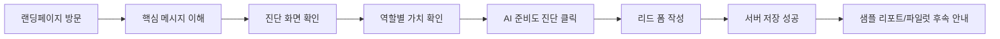

# AgentProof 랜딩페이지 설계문서

- 문서 버전: 1.0
- 구현 대상: AgentProof Landing V4.1
- 상태: 개발 착수 가능
- 작성일: 2026-06-18
- 문서 책임: 제품·콘텐츠·UI 기준 문서

---

## 1. 문서 목적

이 문서는 AgentProof 랜딩페이지를 Codex가 임의 해석 없이 구현할 수 있도록 제품 목적, 타깃, 정보 구조, 화면 문구, 상호작용, 반응형 규칙, 데이터 수집 범위와 완료 기준을 고정한다.

이 페이지의 목적은 완성된 SaaS를 판매하는 것이 아니다. 조직에서 AI를 업무에 사용하거나 도입하려는 사람의 문제 반응을 측정하고, 적합한 리드를 확보해 샘플 리포트와 파일럿 상담으로 연결하는 것이다.

---

## 2. 소스 오브 트루스

구현 중 자료가 충돌하면 아래 우선순위를 따른다.

1. **이 설계문서의 문구·요구사항**
2. `reference/agentproof_v4_target_desktop.png`
3. `reference/agentproof_v4_target_mobile.png`
4. `reference/agentproof_v4_interaction_prototype.html`

주의 사항:

- 데스크톱·모바일 PNG는 **시각적 기준**이다.
- HTML은 모달, UTM 수집, CTA 동작 등 **상호작용 참고용**이다.
- HTML 안의 문구가 이 문서와 다르면 이 문서를 따른다.
- 가짜 고객사 로고, 가짜 후기, 인증 마크, 성과 수치를 추가하지 않는다.
- 대시보드 수치는 반드시 `샘플 데이터`임을 명시한다.

---

## 3. 제품 정의

### 3.1 한 문장 정의

> AgentProof는 조직의 AI 사용 현황과 업무별 기회를 파악하고, 정확성·개인정보·책임 위험을 함께 진단해 도입 우선순위와 사용 기준으로 정리하는 서비스다.

### 3.2 핵심 약속

- AI를 무조건 막지 않는다.
- AI를 무조건 도입하라고 권하지 않는다.
- 업무별로 `허용`, `조건부`, `제한`, `금지` 판단 근거를 만든다.
- 실무자, 대표·도입 담당자, 보안·정책 담당자가 각자 필요한 답을 얻도록 한다.
- 결과는 회의와 내부 승인에 사용할 수 있는 리포트 형태로 정리한다.

### 3.3 현재 단계의 표현

페이지에서는 다음 상태를 투명하게 표시한다.

> 초기 고객검증 단계 · 실제 기밀자료 제출 없이 사전진단 가능

서비스가 이미 완성되었거나 자동으로 법적 적합성을 판정하는 것처럼 표현하지 않는다.

---

## 4. 타깃과 사용자 과업

### 4.1 실무자·직장인

- 상황: ChatGPT, Copilot, Gemini, Claude 또는 사내 AI를 업무에 사용하고 있다.
- 핵심 질문: “이 자료를 AI에 넣어도 되는가?”, “AI 결과를 어디까지 믿어도 되는가?”
- 원하는 결과: 업무별 사용 가능 범위, 입력 주의사항, 외부 제출 전 검토 기준.

### 4.2 대표·도입 담당자

- 상황: 조직 차원의 AI 도입 또는 부서 파일럿을 검토한다.
- 핵심 질문: “어디부터 시작해야 효과가 나는가?”, “보안과 비용을 어떻게 설명할 것인가?”
- 원하는 결과: 도입 우선순위, 준비도 요약, 내부 승인용 근거.

### 4.3 보안·정책·감사 담당자

- 상황: 이미 퍼진 AI 사용을 안전하게 관리해야 한다.
- 핵심 질문: “무엇을 막아야 하는가?”, “어떤 로그와 승인 기록이 필요한가?”
- 원하는 결과: 입력 금지 정보 기준, 사람 검토 절차, 승인·로그·감사 기준.

### 4.4 보조 타깃

- AI 구축·개발·컨설팅 담당자
- HR·내부통제 담당자
- 중소기업·스타트업의 팀장 및 운영 책임자

보조 타깃은 폼에서 선택할 수 있으나, 본문 메시지는 위 세 핵심 타깃에 맞춘다.

---

## 5. 전환 목표

### 5.1 주요 전환

`lead_form_submit`

사용자가 역할, 현재 단계, 가장 걱정되는 문제, 회사/팀명, 업무 이메일을 제출한다.

### 5.2 보조 전환

- `diagnostic_preview_click`: 진단 화면 보기 클릭
- `lead_modal_open`: 진단 신청 모달 열기
- `lead_form_start`: 폼 첫 입력
- `lead_form_error`: 검증 오류 또는 서버 오류
- `lead_form_success`: 서버 저장 완료

### 5.3 성공적인 사용자 흐름



---

## 6. 페이지 정보 구조

페이지는 긴 설명형 사이트가 아니라 다음 다섯 구간으로 제한한다.

1. 헤더
2. 히어로 + 진단 화면 샘플
3. 역할별 가치 + 판단 흐름
4. 진행 방식과 최종 CTA
5. 푸터

별도 기능 소개 섹션, 긴 FAQ, 가격표, 고객 로고, 블로그 목록은 V4.1 범위에서 제외한다.

---

## 7. 화면별 상세 설계와 확정 문구

## 7.1 헤더

### 구성

- 좌측: AgentProof 워드마크
- 우측 데스크톱 내비게이션:
  - `진단 화면` → `#diagnostic`
  - `역할별 가치` → `#roles`
  - `진행 방식` → `#process`
- 우측 주요 버튼: `AI 준비도 진단`

### 동작

- 데스크톱: 상단 고정 또는 sticky.
- 모바일: 로고와 주요 CTA만 노출하고 메뉴 링크는 숨긴다.
- 주요 CTA 클릭 시 신청 모달을 연다.
- 스크롤 시 배경은 반투명 아이보리와 얇은 하단 경계를 유지한다.

---

## 7.2 히어로

### Eyebrow

`AI WORK READINESS`

### H1

> AI를 업무에 쓸 때,  
> 무엇을 맡기고 무엇을 지킬지.

문장부호와 줄바꿈을 그대로 사용한다. 데스크톱에서는 2줄, 모바일에서는 3~4줄이 될 수 있다.

### 설명문

> AgentProof는 조직의 AI 사용 현황과 업무별 기회를 파악하고, 정확성·개인정보·책임 위험을 함께 진단해 도입 우선순위와 사용 기준으로 정리합니다.

### CTA

- Primary: `우리 조직 AI 준비도 확인`
- Secondary: `진단 화면 보기 ↘`

### 보조 문구

> 초기 고객검증 · 실제 기밀이나 개인정보 없이 사전진단

### 디자인 의도

- 메시지와 CTA 외 장식을 최소화한다.
- 과한 그라데이션, 3D 오브젝트, 인공지능 아이콘 모음은 사용하지 않는다.
- 넓은 여백과 큰 타이포그래피가 핵심이다.

---

## 7.3 진단 화면 샘플

### 목적

서비스가 무엇을 결과물로 제공하는지 긴 설명 대신 한눈에 보여준다. 실제 로그인 가능한 제품처럼 오해하지 않도록 `SAMPLE DATA`를 표시한다.

### 외곽 구조

- 밝은 회색 그리드 배경 위의 브라우저/앱 창.
- 좌측 어두운 사이드바, 우측 밝은 리포트 영역.
- 데스크톱에서는 전체 구조 노출.
- 모바일에서는 사이드바를 축소하거나 숨기되, 핵심 판단 카드가 읽혀야 한다.

### 상단 텍스트

- 경로: `agentproof / ai-readiness / 2026-Q2`
- 화면 제목: `업무 AI 도입 진단`
- 보조 문구: `SAMPLE ASSESSMENT · 18 WORKFLOWS · 6 TOOLS`
- 상태 배지: `기준 보완 필요`

### 핵심 상태

- 제목: `도입 가능 · 기준 보완`
- 설명: `5개 업무는 우선 도입, 4개 업무는 사용 기준 보완이 필요합니다.`
- 숫자:
  - `18` / WORKFLOWS
  - `5` / PRIORITY
  - `4` / GAPS

### 업무별 진단 예시

1. `제한` — 개인정보 포함 문서 외부 AI 업로드
2. `조건부` — 고객문의 답변 초안 자동화
3. `도입 추천` — 회의록·보고서 초안 작성

### 상세 패널 예시

- 제목: `개인정보 포함 문서 외부 AI 업로드`
- 카테고리: `AP-021 · DATA HANDLING`
- 설명: 실제 데이터 대신 샘플 문장 2~3줄.
- 권고: `비식별화 · 승인된 도구 사용 · 권한·로그 지정`

### 하단 진단 대상

- 업무용 생성형 AI
- 문서·보고서 작성
- 사내 지식 검색
- AI 업무 자동화

### 접근성

- 전체 목업은 단순 이미지로만 구현하지 않는다.
- 주요 텍스트는 실제 HTML 텍스트로 구현한다.
- 시각적 보조 요소에는 적절한 `aria-hidden`을 사용한다.
- 화면 전체의 accessible name은 `AgentProof AI 업무 도입 진단 샘플 화면`으로 지정한다.

---

## 7.4 역할별 가치

### Section ID

`roles`

### Eyebrow

`FOR EVERY ROLE`

### H2

> 같은 AI를 봐도,  
> 필요한 판단은 다릅니다.

### 카드 1

- 번호: `01`
- 제목: `실무자`
- 본문: `어떤 업무를 AI에 맡겨도 되는지, 결과를 어디까지 확인해야 하는지 명확해집니다.`

### 카드 2

- 번호: `02`
- 제목: `대표·도입 담당자`
- 본문: `효과가 큰 업무부터 도입하고, 비용·위험·내부 승인 근거를 한 번에 봅니다.`

### 카드 3

- 번호: `03`
- 제목: `보안·정책 담당자`
- 본문: `허용 도구, 금지 데이터, 사람 검토와 기록 기준을 업무 단위로 정합니다.`

### 판단 흐름 스트립

데스크톱에서는 가로 5단계, 모바일에서는 세로 5단계로 표현한다.

1. 발견 — `현재 쓰는 AI와 업무`
2. 기회 — `자동화·지원 가능 업무`
3. 위험 — `정확성·개인정보·책임`
4. 기준 — `허용·검토·기록 원칙`
5. 실행 — `도입 우선순위와 가이드`

마지막 단계의 텍스트만 브랜드 블루로 강조한다.

---

## 7.5 진행 방식

### Section ID

`process`

### 배경

- 거의 검정에 가까운 다크 배경.
- 본문 색상은 흰색과 회색.
- 페이지의 최종 전환 구간으로 시각적 대비를 크게 둔다.

### Eyebrow

`AI READINESS`

### H2

> AI를 막기보다,  
> 안전하게 쓸 기준을 만듭니다.

### 설명

> 현재 사용 중인 도구와 도입하려는 업무를 확인해, 바로 실행할 수 있는 우선순위와 가이드로 정리합니다.

### 단계

1. `사용 현황 파악`  
   `누가 어떤 AI를 어떤 업무에 쓰거나 도입하려는지 확인합니다.`
2. `업무별 진단`  
   `기대효과와 정확성·정보보호·책임 위험을 함께 판단합니다.`
3. `실행 기준 정리`  
   `도입 우선순위, 허용 범위와 사람 검토 기준을 제공합니다.`

### CTA

`우리 조직 AI 준비도 확인`

### 하단 안내

> 1차 진단에는 계정 연동이나 실제 기밀자료가 필요하지 않습니다.

---

## 7.6 푸터

- 좌측: `AgentProof`
- 우측/하단:
  - `초기 고객검증 단계 · 화면의 수치와 조직 정보는 예시 데이터입니다.`
  - `개인정보처리방침`
  - 연락 이메일: `agentproof.ai@gmail.com`

실제 도메인과 운영자 정보가 확정되기 전에는 임의 회사명, 사업자번호를 넣지 않는다.

---

## 8. 신청 모달

## 8.1 열기

다음 버튼은 모두 같은 모달을 연다.

- 헤더 `AI 준비도 진단`
- 히어로 `우리 조직 AI 준비도 확인`
- 하단 `우리 조직 AI 준비도 확인`

## 8.2 제목과 설명

- 제목: `AI 준비도 진단 신청`
- 설명: `현재 상황을 남겨주시면 샘플 리포트와 파일럿 안내를 보내드립니다.`

## 8.3 필드

| 필드 | 타입 | 필수 | 값/규칙 |
|---|---|---:|---|
| 역할 | select | 예 | 실무자·직장인 / 대표·임원·팀장 / AI 도입 담당자 / 보안·개인정보·감사 담당자 / AI 구축·개발·컨설팅 담당자 |
| 현재 단계 | select | 예 | 개인 사용 중 / 회사 도입 검토 / 부서 파일럿 준비 / 사용정책 수립 / 고객사 납품·검수 준비 |
| 가장 걱정되는 문제 | select | 예 | 회사자료·기밀 입력 기준 / AI 답변 오류와 검토 책임 / 개인정보·보안 / 내부 설득자료 / 로그·승인·감사 / 도입 우선순위 |
| 회사/팀명 | text | 예 | 2~80자 |
| 업무 이메일 | email | 예 | 정상 이메일 형식, 최대 254자 |
| 상황 설명 | textarea | 아니오 | 최대 1,000자, 민감정보 입력 금지 안내 |
| 개인정보 동의 | checkbox | 예 | 동의 버전과 시각 저장 |
| UTM 4종 | hidden | 아니오 | source, medium, campaign, content |

## 8.4 상태

- 기본
- 클라이언트 검증 오류
- 제출 중: 버튼 비활성화 + `신청 중…`
- 성공: `신청이 완료되었습니다. 확인 후 업무 이메일로 안내드리겠습니다.`
- 실패: `신청을 저장하지 못했습니다. 잠시 후 다시 시도해주세요.`
- 중복 클릭 방지

## 8.5 접근성 동작

- 열릴 때 첫 필드로 포커스 이동.
- 모달 내부 포커스 트랩.
- `Escape`, 닫기 버튼, 배경 클릭으로 닫기.
- 닫은 뒤 모달을 연 버튼으로 포커스 복귀.
- 오류는 필드와 연결된 텍스트로 설명하고, 첫 오류로 포커스 이동.
- 성공 메시지는 `role="status"`, 실패는 `role="alert"`.

---

## 9. 시각 시스템

## 9.1 컬러 토큰

| 토큰 | 값 | 용도 |
|---|---|---|
| `--color-ink` | `#0F1117` | 주 텍스트, 버튼, 다크 섹션 |
| `--color-paper` | `#F6F5F0` | 기본 배경 |
| `--color-surface` | `#FFFFFF` | 카드, 모달 |
| `--color-muted` | `#667085` | 보조 텍스트 |
| `--color-line` | `#E3E6EC` | 경계 |
| `--color-accent` | `#315EFB` | 링크, 마지막 단계 강조 |
| `--color-success` | `#0B7D5F` | 도입 추천 |
| `--color-warning` | `#B56B00` | 조건부 |
| `--color-danger` | `#C93636` | 제한 |

색은 의미를 보조해야 하며 색만으로 상태를 전달하지 않는다.

## 9.2 타이포그래피

```css
font-family: Pretendard, "Apple SD Gothic Neo", "Noto Sans KR", Inter, system-ui, sans-serif;
```

외부 폰트 파일을 저장소에 포함하지 않는다. 시스템 폰트 폴백으로도 레이아웃이 무너지지 않아야 한다.

권장 크기:

- Hero H1: 82px desktop / 42~52px mobile
- Section H2: 56px desktop / 34~40px mobile
- Body large: 17~18px
- Body: 14~16px
- Label: 10~12px

한글 본문은 `word-break: keep-all`을 기본으로 하되 좁은 화면에서는 넘침이 없어야 한다.

## 9.3 레이아웃

- 콘텐츠 최대 폭: 1180px
- 데스크톱 좌우 여백: 최소 24px
- 모바일 좌우 여백: 14~20px
- 섹션 간격: 96~120px desktop / 72~88px mobile
- 카드 모서리: 12~16px
- 버튼 높이: 44px 이상

## 9.4 브레이크포인트

- Wide: 1440px 이상
- Desktop: 1024~1439px
- Tablet: 768~1023px
- Mobile: 360~767px
- 최소 지원 폭: 320px

---

## 10. 반응형 규칙

### 데스크톱

- 히어로 중앙 정렬.
- 앱 화면 전체 노출.
- 역할 카드는 3열.
- 판단 흐름은 5열.
- 단계 행은 번호 / 제목 / 설명 3열.

### 태블릿

- 앱 화면의 사이드바 폭 축소.
- 역할 카드는 3열 유지 가능하나 폭이 부족하면 세로 구분선형 1열로 전환.
- 내비게이션 텍스트는 화면에 따라 숨길 수 있다.

### 모바일

- 히어로 CTA는 세로 100% 너비.
- 앱 화면은 핵심 카드 중심으로 축약한다.
- 역할 카드는 1열, 구분선으로 연결.
- 판단 흐름은 세로 카드.
- 진행 단계는 1열.
- 모달은 화면 하단 시트 또는 거의 전체 화면으로 표시한다.
- 가로 스크롤이 절대 발생하지 않아야 한다.

---

## 11. SEO와 공유 메타데이터

### Title

`AgentProof | 조직 AI 업무 도입 준비도 진단`

### Description

`조직의 AI 사용 현황과 업무별 기회를 파악하고 정확성, 개인정보, 책임 위험을 진단해 도입 우선순위와 사용 기준으로 정리합니다.`

### Open Graph

- `og:title`: `AI를 업무에 쓸 때, 무엇을 맡기고 무엇을 지킬지.`
- `og:description`: 메타 설명과 동일
- `og:type`: `website`
- `og:image`: 1200×630 전용 이미지, 샘플 화면과 헤드라인 사용

### 기타

- canonical URL
- robots 기본 index/follow
- sitemap
- Organization 또는 SoftwareApplication 스키마는 실제 운영 정보가 확정된 범위만 사용

---

## 12. 분석 이벤트

| 이벤트 | 발생 시점 | 필수 파라미터 |
|---|---|---|
| `page_view` | 페이지 로드 | landing_variant, utm_* |
| `diagnostic_preview_click` | 진단 화면 보기 클릭 | placement |
| `lead_modal_open` | CTA로 모달 열기 | placement |
| `lead_form_start` | 첫 필드 입력 | role_if_known |
| `lead_form_submit_attempt` | 제출 버튼 클릭 | role, stage, concern |
| `lead_form_validation_error` | 클라이언트 검증 실패 | field_names |
| `lead_form_success` | 서버 저장 성공 | lead_id, role, stage, concern |
| `lead_form_server_error` | 서버 오류 | error_code |
| `nav_anchor_click` | 내비게이션 클릭 | target |

분석 도구에는 이메일, 회사명, 메모 등 개인정보를 보내지 않는다.

---

## 13. 개인정보와 보안 원칙

- 폼은 고객검증과 후속 안내에 필요한 최소 정보만 수집한다.
- 실제 기밀자료, 고객 데이터, 개인정보가 포함된 문서를 받지 않는다.
- 업무 이메일은 분석 이벤트에 포함하지 않는다.
- 개인정보 보유 기간 기본값은 고객검증 종료 후 3개월이다.
- 삭제 요청 대응을 위한 연락처를 개인정보처리방침에 명시한다.
- 프런트엔드에 API 비밀키를 노출하지 않는다.
- 서버에서 입력값 길이, 타입, 허용 목록을 재검증한다.

---

## 14. 범위에서 제외하는 것

V4.1에서는 다음을 구현하지 않는다.

- 회원가입·로그인
- 실제 AI 도구 계정 연동
- 실제 조직 데이터 자동 수집
- 자동 규제 적합성 판정
- 결제
- 고객용 대시보드 계정
- PDF 자동 생성
- 관리자 CRM 전체 기능
- 실시간 상담 채팅

이 기능은 V5 개선 계획의 검증 조건을 충족한 뒤 결정한다.

---

## 15. 페이지 완료 기준

다음 조건을 모두 만족해야 디자인 구현 완료로 본다.

- 확정 문구가 누락 없이 반영된다.
- 데스크톱과 모바일이 참조 이미지의 구조와 위계를 유지한다.
- CTA 세 곳이 동일한 모달을 연다.
- 모달이 키보드와 모바일에서 정상 작동한다.
- 폼이 실제 서버 저장까지 동작한다.
- UTM이 저장된다.
- 성공·실패 상태가 사용자에게 명확히 표시된다.
- 가짜 로고·후기·인증·성과 수치가 없다.
- 모든 샘플 수치에 `SAMPLE DATA` 또는 예시 데이터 고지가 있다.
- 개인정보처리방침 링크가 존재한다.
- QA 문서의 P0·P1 항목이 모두 통과한다.
